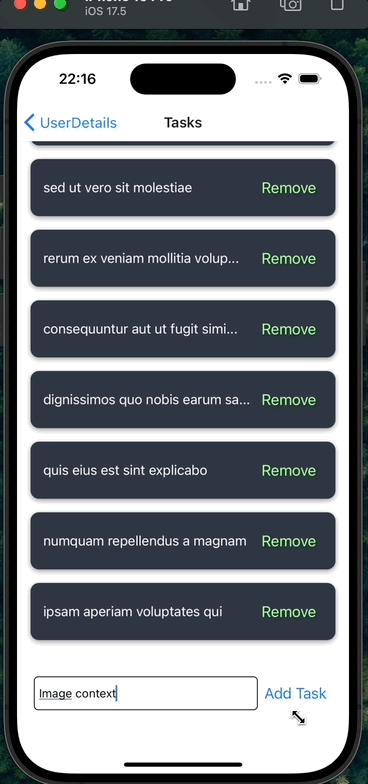

<h1>ContextTaskApp</h1>

Bu proje, kullanıcıların görevlerini ve kullanıcı bilgilerini yönetmelerini sağlayan bir React Native uygulamasıdır. Görev ekleme, silme ve kullanıcı detaylarını görüntüleme gibi temel özellikleri içerir.

<h2> Kullanılan Teknolojiler</h2>

- **@react-navigation/native**: Navigasyon için
- **@react-navigation/stack**: Yığın tabanlı navigasyon için
- **axios**: HTTP istekleri için
- **react**: Ana kütüphane
- **react-native**: Mobil geliştirme için
- **react-native-gesture-handler**: Jest işlemleri için
- **react-native-safe-area-context**: Güvenli alan yönetimi için
- **react-native-screens**: Ekran optimizasyonu için

<h2> Özellikler</h2>

- 📱 **Kullanıcı Dostu Arayüz**: Basit ve sezgisel tasarım
- ➕ **Görev Ekleme**: Yeni görevler oluşturma
- 🗑️ **Görev Silme**: Görevleri kaldırma
- 📋 **Kullanıcı Listesi**: Kullanıcıları listeleme
- 🔍 **Kullanıcı Detayları**: Kullanıcı detaylarını görüntüleme
- 🌐 **API Entegrasyonu**: Görevler ve kullanıcılar için API'den veri çekme

<h2>Ekran Görüntüsü</h2>

